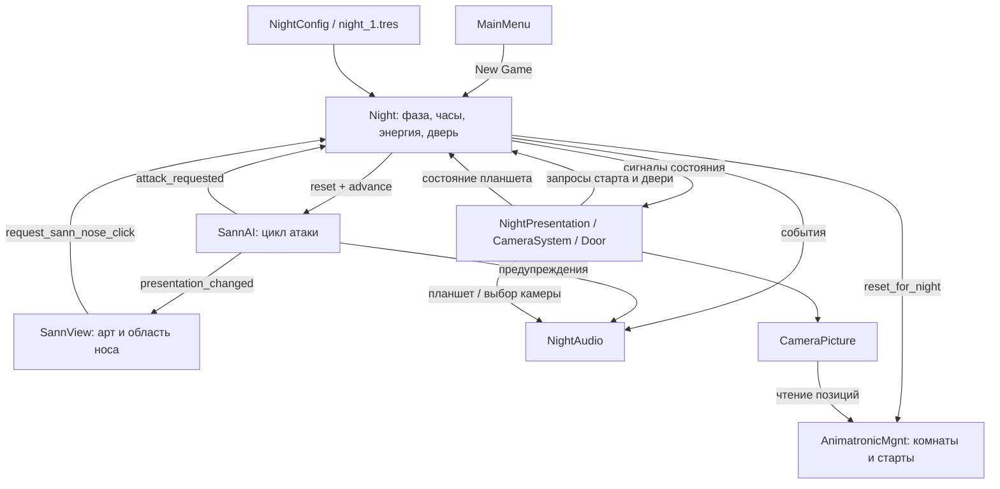

# Текущая архитектура FNAB

Документ отражает реализованный срез первой ночи, а не будущую систему всех ночей. Карта: [PROJECT_MAP.md](PROJECT_MAP.md); правила: [GAMEPLAY.md](GAMEPLAY.md); допущения: [GAMEPLAY_PARAMETERS.md](GAMEPLAY_PARAMETERS.md).

**VERIFIED** — исходники/проверка; **LIKELY** — временная трактовка; **UNKNOWN** — не установлено.

## Состав и направление зависимостей

**VERIFIED:** Night остаётся владельцем фаз, времени, энергии и двери. Нужная для N1 логика отделена от HUD/анимаций: Night эмитит события, представления показывают состояние и запрашивают действия.

Сцены задают соединение компонентов и экспортированные ссылки. Плееры принадлежат Night; нового Autoload нет. Legacy Camera2D панорамирует офис независимо от выбора вида наблюдения.

## Владельцы состояния

| Состояние | Единственный игровой владелец | Представление / потребитель |
|---|---|---|
| INTRO/RUNNING/POWER_OUT/WON/LOST | `Night.phase` | Карточки, затемнение, доступность управления, звук |
| Часы и минуты | `Night.hours/minutes`, накопитель времени | HUD, финальный результат |
| Энергия и расход | `Night.power_left`, `get_total_energy_consumption()` | Батарея и индикатор расхода |
| Дверь и флаги вентиляторов | Night | Door/Button наблюдают принятое изменение |
| Цикл Санна | `SannAI.active/warning_active/warning_remaining/stage` | SannView и NightAudio |
| Комнаты четырёх маршрутных персонажей | AnimatronicMgnt | CameraPicture |
| Открытие планшета/анимации | CameraSystem, состояние представления | Night получает guard закрытого/перекрытого офиса |
| Номер ночи между сценами | Global; при входе задаётся конфигурацией | Выбор варианта изображения Dog |

Все строки **VERIFIED** по указанным символам. UI не пишет фазу, энергию или позицию персонажа. Защитный запрос проверяет Night, а не видимость спрайта.

## Игровой контракт

**VERIFIED:** Night предоставляет `begin_night()`, `request_door_toggle()`, `request_sann_nose_click()`, `set_monitor_open()`, `is_player_input_allowed()`, `advance(delta)`.

Сигналы Night: `phase_changed`, `time_changed`, `power_changed`, `consumption_changed`, `door_changed`, `night_started`, `sann_nose_clicked`, `outcome_reached(won, reason)`. Причины результата: `time`, `sann`, `power`.

SannAI: `reset(config)`, `advance(delta)`, `defend()`, `stop()`, `is_warning_active()`; сигналы `presentation_changed`, `warning_started`, `warning_urgent`, `defended`, `attack_requested`. SannAI не читает UI и не меняет фазу ночи.

CameraSystem: `monitor_changed`, `remote_changed`, `camera_selected` для звука. Кнопки камер направлены в обработчики CameraSystem, которые вызывают существующие `CameraPicture.set_*()`; отдельной модели комнатных камер/графа нет.

## Последовательность одного шага

**VERIFIED:** `Night.advance()` делит время на шаги до 0,05 с и последовательно:
1. Продвигает часы; при достижении конца фиксирует победу и прекращает дальнейший шаг.
2. В POWER_OUT считает grace до поражения; часы продолжают идти.
3. В RUNNING списывает расход раз в реальную секунду, ограничивает энергию нулём; при нуле выключает защитные состояния и останавливает Санна.
4. Только если ночь всё ещё RUNNING, продвигает SannAI.

Один владелец времени предотвращает независимый timeout атаки после завершения ночи. Терминальный переход охраняется от повторного исхода. На одном шаге победа имеет приоритет — **LIKELY** как временное правило замысла, **VERIFIED** как порядок реализации.

## Сигналы сцен и ввод

**VERIFIED:** меню динамически соединяет New Game/Continue/Exit; Computer mouse_entered/exited и Timer.timeout остаются сценовыми связями. Дверная область делает один запрос через DoorButton; Door наблюдает `door_changed`, поэтому два обработчика не переключают состояние дважды.

Нос принимает только новое нажатие левой кнопкой в состоянии предупреждения. Запрос отклоняется при закрытом игровом доступе или перекрытом планшетом офисе. Показ/скрытие монитора и пульта остаётся наведением на старые области; завершения анимаций управляют отображением.

Global сохраняет прежние `power_left_changed` / `energy_consumption_changed` для совместимости, но текущий HUD наблюдает Night. Нет второго владельца мощности в Global.

## Конфигурация и границы среза

**VERIFIED:** `NightConfig` хранит только данные; runtime-состояние Resource не изменяется. Копия конфигурации может применяться в тесте. Значения N1 находятся в `resources/night_1.tres` / defaults `scripts/night_config.gd`.

Четыре прежних маршрута сохранены, но не исполняются. Санн стационарен в офисе и не нуждается в фиктивном маршруте. Значения уровней других персонажей 0 в N1; установка ненулевого значения не создаёт отсутствующие AI.

**VERIFIED:** Phone Guy не заменён выдуманной записью: реализован явный экран старта. Шокер, управление вентиляторами/атаки Пса и Блэки, сохранения и последующие ночи за пределами выполненного N1. Их временные параметры не считаются реализацией.

**UNKNOWN:** окончательная трактовка исторических стадий Санна, механики остальных AI и качество слухового/визуального баланса. Существующий неиспользуемый `AnimatronicMgnt.next()` остаётся непригодным для общего движения; его не используют в этой ночи.
