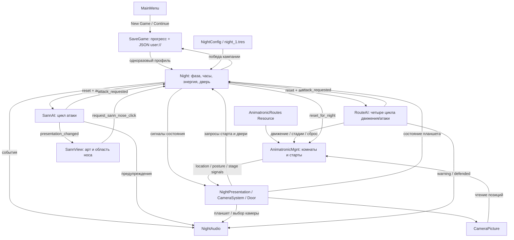

# Текущая архитектура FNAB

Документ отражает текущие системы ночи, включая маршрутный AI, вентиляторы и шокер. Карта: [PROJECT_MAP.md](PROJECT_MAP.md); правила: [GAMEPLAY.md](GAMEPLAY.md); допущения: [GAMEPLAY_PARAMETERS.md](GAMEPLAY_PARAMETERS.md).

**VERIFIED** — исходники/проверка; **LIKELY** — временная трактовка; **UNKNOWN** — не установлено.

## Состав и направление зависимостей

**VERIFIED:** Night остаётся владельцем фаз, времени, энергии и двери. Нужная для N1 логика отделена от HUD/анимаций: Night эмитит события, представления показывают состояние и запрашивают действия.

Сцены задают соединение компонентов и экспортированные ссылки. Плееры принадлежат Night; нового Autoload нет. Legacy Camera2D панорамирует офис независимо от выбора вида наблюдения.

## Владельцы состояния

| Состояние | Единственный игровой владелец | Представление / потребитель |
|---|---|---|
| INTRO/RUNNING/POWER_OUT/WON/LOST | `Night.phase` | Карточки, затемнение, доступность управления, звук |
| Часы и минуты | `Night.hours/minutes`, накопитель времени | HUD, финальный результат |
| Энергия и расход | `Night.power_left`, `get_total_energy_consumption()` | Батарея и индикатор расхода |
| Дверь и флаги вентиляторов | Night | Door/Button/пульт и звук наблюдают принятое изменение |
| Откат шокера | `Night.shock_cooldown_remaining` | Кнопка камеры 2 и индикатор |
| Выбранный вид и доступ к наблюдению | `Night.current_camera_index/surveillance_open` | CameraSystem передаёт изменения; Night проверяет шокер |
| Цикл Санна | `SannAI.active/warning_active/warning_remaining/stage` | SannView и NightAudio |
| Комнаты четырёх маршрутных персонажей | AnimatronicMgnt | CameraPicture |
| Счётчики проверки, предупреждения и защиты четырёх AI | `RouteAI._states` | Night, звук; позиции не дублируются |
| Открытие планшета/анимации | CameraSystem, состояние представления | Night получает guard закрытого/перекрытого офиса |
| Номер ночи между сценами | Global; при входе задаётся конфигурацией | Выбор варианта изображения Dog |

Все строки **VERIFIED** по указанным символам. UI не пишет фазу, энергию или позицию персонажа. Защитный запрос проверяет Night, а не видимость спрайта.

## Игровой контракт

**VERIFIED:** Night предоставляет `begin_night()`, `request_door_toggle()`, `request_sann_nose_click()`, `set_monitor_open()`, `is_player_input_allowed()`, `advance(delta)`.

Сигналы Night: `phase_changed`, `time_changed`, `power_changed`, `consumption_changed`, `door_changed`, `night_started`, `sann_nose_clicked`, `outcome_reached(won, reason)`. Причины результата: `time`, `sann`, `power`.

SannAI: `reset(config)`, `advance(delta)`, `defend()`, `stop()`, `is_warning_active()`; сигналы `presentation_changed`, `warning_started`, `warning_urgent`, `defended`, `attack_requested`. SannAI не читает UI и не меняет фазу ночи.

RouteAI: `reset(config, night)`, `advance(delta)`, `stop()`, `shock_old_creeper()`, `get_warning_room(character)`, `get_warning_remaining(character)`; сигналы `warning_started(character, room)`, `warning_ended(character)`, `defended(character, room)`, `attack_requested(character)`. Night передаёт игровой контекст двери/вентиляторов. Зависимости от UI нет.

Night дополнительно предоставляет `request_fan_toggle(side)`, `request_shock()`, `set_surveillance_open(open)`, `select_surveillance_camera(index)` и сигналы `fan_changed`, `shock_used`, `shock_cooldown_changed`. Стороны: 0 — левая, 1 — правая. Причины исходов дополнены `dog`, `berry`, `blacky`, `old_creeper`.

Менеджер: `advance_character(character, rng)`, `reset_character(character)`, `get_position()`, `get_route_index()`, `set_old_creeper_state()`; события `location_changed`, `posture_changed`, `old_creeper_state_changed`. Старые getters сохранены. Маршруты менеджера — getter-алиасы Resource, не отдельные копии.

CameraSystem: `monitor_changed`, `remote_changed`, `camera_selected` для звука. Кнопки камер направлены в обработчики CameraSystem, которые вызывают существующие `CameraPicture.set_*()`; отдельной модели комнатных камер/графа нет.

## Последовательность одного шага

**VERIFIED:** `Night.advance()` делит время на шаги до 0,05 с и последовательно:
1. Продвигает часы; при достижении конца фиксирует победу и прекращает дальнейший шаг.
2. В POWER_OUT считает grace до поражения; часы продолжают идти.
3. В RUNNING списывает расход раз в реальную секунду, ограничивает энергию нулём; при нуле выключает защитные состояния и останавливает Санна.
4. Только если ночь всё ещё RUNNING, продвигает SannAI, затем RouteAI. После синхронного исхода следующий AI не обновляется.
5. В RUNNING уменьшает откат шокера.

Один владелец времени предотвращает независимый timeout атаки после завершения ночи. Терминальный переход охраняется от повторного исхода. На одном шаге победа имеет приоритет — **LIKELY** как временное правило замысла, **VERIFIED** как порядок реализации.

## Сигналы сцен и ввод

**VERIFIED:** меню динамически соединяет New Game/Continue/Exit; Computer mouse_entered/exited и Timer.timeout остаются сценовыми связями. Дверная область делает один запрос через DoorButton; Door наблюдает `door_changed`, поэтому два обработчика не переключают состояние дважды.

Нос принимает только новое нажатие левой кнопкой в состоянии предупреждения. Запрос отклоняется при закрытом игровом доступе или перекрытом планшетом офисе. Показ/скрытие монитора и пульта остаётся наведением на старые области; завершения анимаций управляют отображением.

Global сохраняет прежние `power_left_changed` / `energy_consumption_changed` для совместимости, но текущий HUD наблюдает Night. Нет второго владельца мощности в Global.

## Конфигурация и границы среза

**VERIFIED:** `NightConfig` хранит только данные; runtime-состояние Resource не изменяется. Копия конфигурации может применяться в тесте. Значения N1 находятся в `resources/night_1.tres` / defaults `scripts/night_config.gd`.

Четыре маршрута исполняются RouteAI при ненулевом уровне. Маршрут Пса уточнён автором: только коридор. Санн стационарен в офисе. Уровни остальных в N1 остаются 0; профили N2–N6 выбираются через сохранённую контрольную точку SaveGame.

**VERIFIED:** Phone Guy не заменён выдуманной записью: используется экран старта. Шокер, вентиляторы и четыре маршрутных AI реализованы. Сохранения между ночами и выбор следующего профиля реализованы; особые сюжетные события ночей отсутствуют.

**UNKNOWN:** окончательная трактовка исторических таймингов/стадий и качество слухового/визуального баланса. Выбранные вероятности, ускорение Пса и порядок стадий ОК явно отмечены как временные в GAMEPLAY_PARAMETERS. `AnimatronicMgnt.next()` теперь делегирует безопасное движение по индексам; RouteAI вызывает `advance_character()` напрямую.

## Сохранения между сценами

**VERIFIED:** `SaveGame` — новый Autoload: прогресс живёт между меню и ночами, поэтому он общеприложенческий. `Night._ready()` потребляет одноразовый запрос, выбирает NightConfig и сохраняет ID кампании. `Night._finish()` записывает победу только при `is_campaign_run()`. Прямые редакторские/тестовые профили не меняют сохранение. `progress_save_failed` сообщает UI об отказе записи, не меняя исход смены. Global хранит только текущий номер для существующих изображений. Runtime ночи не сериализуется. Ошибки видны в меню и на результате; [SAVE_SYSTEM.md](SAVE_SYSTEM.md) описывает контракт и ограничения.
